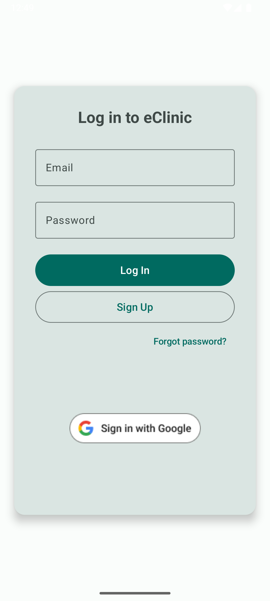
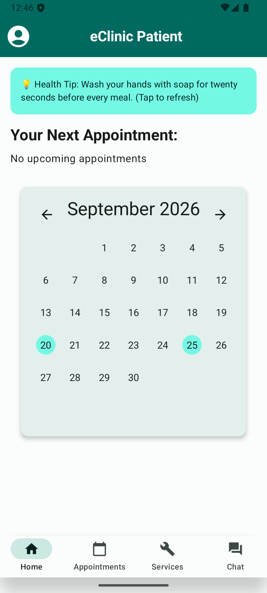
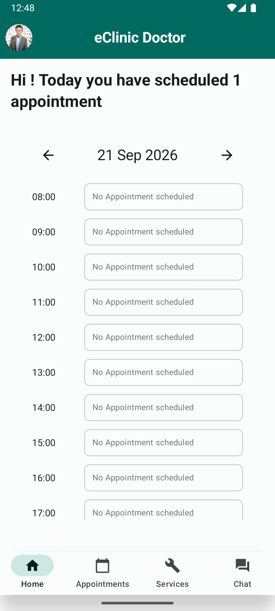
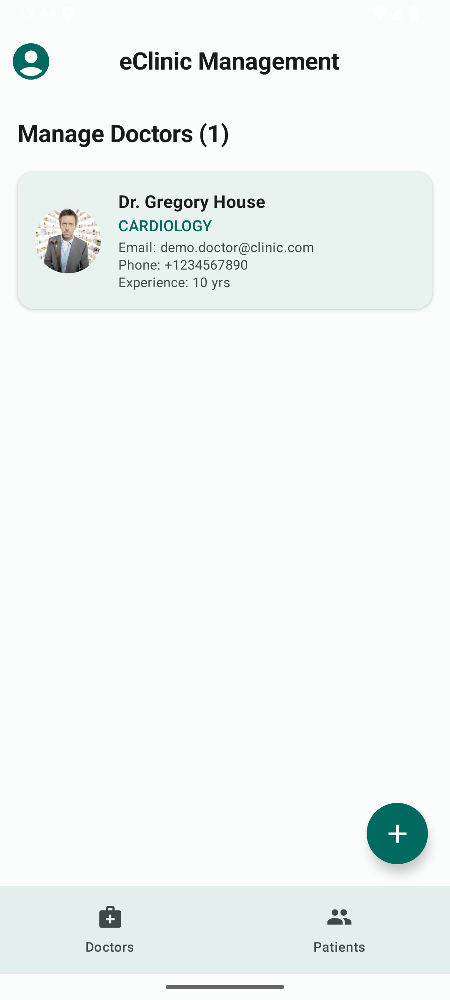

# eClinic — Android Telemedicine Platform

A native Android application for managing a remote medical clinic, connecting **patients**, **doctors**, and **administrators** in a single role-based system. Built with Kotlin and Jetpack Compose on top of Firebase.

> NOTE: This repository is a security- and dependency-hardened fork of a university group project.
> **Disclaimer — Demonstration project only.** This application is a portfolio project built for educational and recruitment purposes. It is **not a certified medical device**, has not undergone any clinical, regulatory, or security audit, and must **not** be used for real patient care, real prescriptions, real appointment booking, or the storage of real personal or medical data. All accounts, patients, doctors, and medical records referenced in this repository (including the demo accounts below) are fictional test data.

## Screenshots
 
<table>
<tr>
<td align="center"><br/><sub>Login</sub></td>
<td align="center"><br/><sub>Patient — Home</sub></td>
<td align="center"><br/><sub>Doctor — Schedule</sub></td>
<td align="center"><br/><sub>Admin — Manage Doctors</sub></td>
</tr>
</table>


## Features
- **Role-based access** — separate user interfaces and functionalities for patients, doctors, and administrators
- **Appointment booking** — real-time doctor availability, timeslot management, cancellations
- **Prescriptions** — structured prescribing flow backed by a 12,000+ entry drug database (using prepared Polish Ministry of Health dataset from 2025)
- **In-app messaging** — real-time chat with text and image attachments, built on Firestore
- **AI symptom guide** — Gemini-powered assistant that helps patients pick the right specialization
- **Secure authentication** — email/password and Google Sign-In, plus biometric login and PIN-code unlock
- **Admin console** — doctor onboarding, user management, timeslot generation
- **Push notifications** — Firebase Cloud Messaging, with scheduled reminder logic in Cloud Functions and chat notifications


## Tech Stack
 
| Layer | Technology |
|---|---|
| Language | Kotlin |
| UI | Jetpack Compose |
| Backend | Firebase (Auth, Firestore, Storage, Cloud Messaging, Cloud Functions) |
| AI | Google Generative AI (Gemini) |
| Architecture | Repository pattern over Firestore collections |


## Getting Started
 
### Prerequisites
 
- Android Studio (recent stable release)
- JDK 17
- Android SDK Platform 35 (min SDK 26)

### Setup
 
1. Clone the repository:
```bash
   git clone https://github.com/jakgru31/e-clinic-rework.git
```
2. Open the project in Android Studio and let Gradle sync — `google-services.json` is already included, no Firebase project setup is required to build and run.
3. *(Optional)* To enable the AI symptom checker, create a `local.properties` file in the project root and add:
```properties
   GEMINI_API_KEY=your_key_here
```
   A free key can be generated in one click at [Google AI Studio](https://aistudio.google.com/). Without this key, the app builds and runs normally — the AI assistant screen simply displays a message instead of a response.
4. Run the app on an emulator or physical device (API 26+) — see below for emulator-specific setup.
 
### How to Emulate Locally
 
This app depends on Google Play services (Firebase Auth, Google Sign-In, FCM), so it **must** run on an emulator image that includes the Google Play Store / Google APIs — a plain AOSP image will fail to sign in.
 
1. In Android Studio: **Tools → Device Manager → Create Virtual Device**.
2. Pick any modern phone profile (e.g. Pixel 8 or 9).
3. When choosing a system image, select one **with the Google Play icon** — e.g. Android 16 (API 36) or Android 17 (API 37). Images without this icon do not include Google Play services.
4. Finish the wizard, start the emulator, then
 click the green **Run ▶** button in Android Studio (`Shift+F10`).

### Building an APK from the command line
 
Debug build (no signing required):
```bash
./gradlew assembleDebug
```
Output: `app/build/outputs/apk/debug/app-debug.apk`
 
### Installing the pre-built APK (no build required)
 
A ready-to-use APK is attached to the **GitHub Release** of this repository — this is the fastest way to try the app without setting up Android Studio or building from source.
 
1. Go to **https://github.com/jakgru31/e-clinic-rework/releases**
2. Under the latest release, download the `eclinic.apk` file listed in "Assets".
3. Start an Android emulator (API 26+, **with Google Play services** — see above) from Android Studio's Device Manager, **or** enable "Install from unknown sources" on a physical device.
4. Drag and drop the downloaded `.apk` file directly onto the running emulator window — installation starts automatically.
   - Alternatively, via ADB:
```bash
     adb install path/to/eclinic.apk
```
5. Launch **eClinic** from the emulator's app drawer.
> **Note:** if you previously ran this project from Android Studio (`Run ▶`) on the same emulator, it will already have a debug-signed copy installed under the same package name. Installing the release APK on top of it will fail with `INSTALL_FAILED_UPDATE_INCOMPATIBLE` (signature mismatch). Uninstall the existing app first: `adb uninstall com.example.e_clinic`, then install again.


## Demo Accounts
 
Patient self-registration is available from the app's sign-up screen. Doctor and administrator accounts cannot self-register by design — use the credentials below to explore those roles directly:
 
| Role | Email | Password |
|---|---|---|
| Patient | `demo.user@clinic.com` | `userP*ssw0rd1` |
| Doctor | `demo.doctor@clinic.com` | `doctorP*ssw0rd1` |
| Administrator | `admin@clinic.com` | `P*ssw0rd1` |

### Quick Evaluation Flow (~5 minutes)
1. **Log in as Patient** (`demo.user@clinic.com`) — check the AI health tip on Home, check the calendar, change your data, try the AI symptom-checker assistant, book an appointment, or send a chat message to a doctor.
2. **Log in as Doctor** (`demo.doctor@clinic.com`) — view scheduled appointments, open a patient's medical history, and issue a prescription (drug name autocompletes from the 12,000-entry database).
3. **Log in as Administrator** (`admin@clinic.com`) — manage doctor accounts and generate new appointment timeslots.

## Project Status & Known Limitations
 
The following limitations and changes from original project are disclosed below:
 
- **Real-time chat/video previously used the ZEGOCloud SDK.** Access to those API credentials expired and could not be renewed in time. The video-call feature has been removed from the UI; real-time **text and image chat has been rebuilt from scratch on Firestore** (see `Firebase/Repositories/ChatRepository.kt`), including size- and content-type-restricted image uploads.
- **Scheduled Cloud Functions** (appointment reminders, stale-timeslot cleanup) are included under `functions/` but require the Firebase project to be on the Blaze (pay-as-you-go) plan to deploy. Deploy with:
```bash
  cd functions && npm install
  firebase deploy --only functions
```
- **Firestore Security Rules** are role-based and scoped per-collection (see `firestore.rules`) — patients and doctors can only read/write data they own; administrators have elevated access. This was a deliberate hardening pass over the original project's rules.

## Repository Structure
 
```
app/src/main/java/com/example/e_clinic
├── AIAssistant/              # Gemini-powered symptom checker
├── CSV/                      # Drug database loader (dataset located in app/src/main/assets)
├── Firebase/
│   ├── CloudMessaging/       # FCM token/message handling
│   ├── FirestoreDatabase/    # Collection data classes (models)
│   ├── Repositories/         # Data-access layer, one repository per collection
│   └── Storage/              # Profile pictures, prescriptions uploads
├── Services/                 # PIN manager, hashing, local utilities
└── UI/
    ├── activities/
    │   ├── admin_screens/    # Administrator role UI
    │   ├── chat/             # Firestore-based real-time chat, replaced former ZEGOCloud implementation
    │   ├── doctor_screens/   # Doctor role UI
    │   ├── user_screens/     # Patient role UI
    │   └── ...               # Auth screens (Login, SignUp, PIN, Password reset)
    └── theme/                # Compose Material theme
 
firestore.rules              # Role-based Firestore security rules
storage.rules                # Firebase Storage security rules
functions/                   # Scheduled Cloud Functions (reminders, cleanup, chat)
```

## Authors
 
Originally developed as a university group project by Jakub Gruszka, Nazarii Zavhorodnii, and Lateef Hanus. This fork was reworked by Jakub Gruszka.

